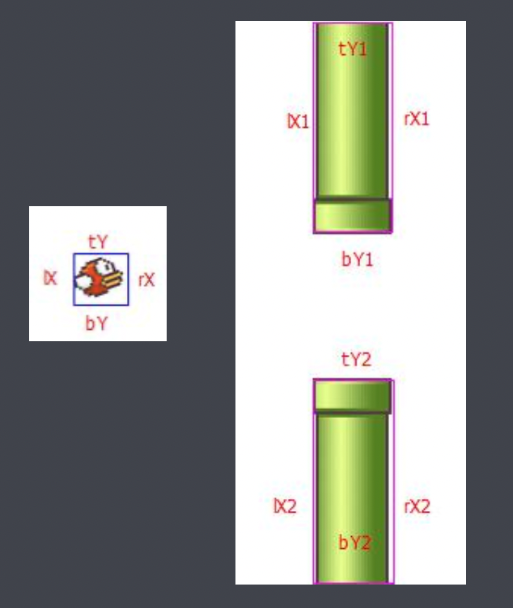

## 面向对象编程抽象类

* Main 类 -- 控制游戏的状态、定时器
* 背景类 -- 管理背景渲染、更新
* 管子类 -- 管理管子的渲染、更新
* 小鸟类 -- 管理小鸟的渲染、更新、上升
* 分数计算 
* 场景管理

## Main 类

* 全局调用
* 管理其他类
* 游戏初始化
* 设置游戏动画的主定时器

## 数据类 DataBus

* 全局数据管理，使用单例模式
* 存储所有公用的变量数据
* 使用数组管理所有演员，方便批量渲染
* 设置添加数组演员方法
* 设置重置游戏方法，清空一些变动的数据

## 资源类 ResourceLoader

* 图片资源管理
* 保证所有图片资源下载完毕后开始游戏

## 背景类

* 包含天空类 Background 和大地类 Land
* 渲染背景
* 背景运动
* 注意:canvas 中可以渲染 3 张图片背景，进行无缝滚动，制作连续运动动画

## 管子类 Pipe
* 上下一对儿管子，我们称为是一个 Pipe 类的实例
* 管子类每隔一定的帧数 100 生成一个实例
* 管子类需要生成多个实例，加载位置在屏幕外
* 为了减少演员数组的个数，管子出了屏幕，设置自动销毁

## 小鸟类Bird
* 随机生成一个颜色的小鸟
* 小鸟飞行震动翅膀
* 定义小鸟减速上升和加速下降，上升到顶部保持y轴位置，降落到地面，游戏结束 • 鼠标点击画布，小鸟上升，到达顶点开始下降

## 鸟和管子碰撞检测
* 在管子类 Pipe 中，判断每一套管子是否与唯一的小鸟碰撞。

## 场景管理
* FlappyBird 有三个场景:开始画面、游戏过程、结束画面。
* 整理代码:
* 1.将 Main 中的演员都移动到对应场景中管理
* 2.场景的切换:0 开始画面、1 游戏过程、2 结束画面
* 3.演员的上台和下台在不同阶段，进行分别管理 
* 4.将管理变量存储到 databus 中

## 分数计算
* 判断小鸟是否通过管子，通过积一分 
* 在场景 2 结束画面中，添加计分板 
* 每次结束游戏都要比较记录最高成绩
